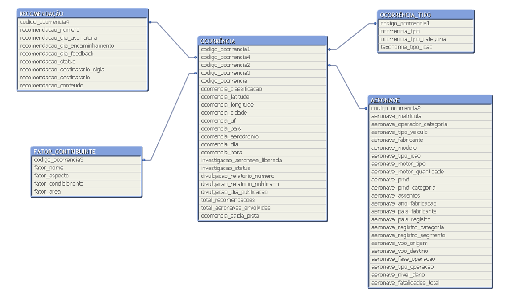

# Fundamentos_de_ETL_com_Python
 Fundamentos de ETL com Python

<h1>Trabalhando com Dados Acidentes áereos do Cnipa.</h1>

Fonte:  [cenipa](https://www2.fab.mil.br/cenipa/)

Dados Abertos: [dados](https://dados.gov.br/dataset/ocorrencias-aeronauticas-da-aviacao-civil-brasileira)

CENIPA - Ocorrências Aeronáuticas na Aviação Civil Brasileira
Dados de ocorrências aeronáuticas da aviação civil brasileira nos últimos 10 anos.

<h2>Opendata AIG Brazil</h2>

A base de dados de ocorrências aeronáuticas é gerenciada pelo Centro de Investigação e Prevenção de Acidentes Aeronáuticos (CENIPA). Constam nesta base de dados as ocorrências aeronáuticas notificadas ao CENIPA nos últimos 10 anos e que ocorreram em solo brasileiro.

Dentre as informações disponíveis estão os dados sobre as aeronaves envolvidas, fatalidades, local, data, horário dos eventos e informações taxonômicas típicas das investigações de acidentes (AIG). São resguardadas a privacidade de pessoas físicas/jurídicas envolvidas conforme previsto pela Lei de Acesso à Informação (Lei n° 12.527, de 18 de novembro de 2011).

Essa base de dados é composta por informações preliminares provenientes do formulário CENIPA-05 (Ficha de Notificação de Ocorrências Aeronáuticas) e consolidada a partir dos relatórios de investigações publicados. Outra forma de visualização desses dados é pelo Painel SIPAER disponível na página do CENIPA.

Dados proveniente dos Programas de Gerenciamento de Prevenção administrados pelo CENIPA (Emissão de Raio Laser e Risco Baloeiro) não constam nesta base. Esses programas possuem formulários próprios para coleta de dados com foco exclusivo para gerenciamento do risco, enquanto os dados coletados pelo formulário CENIPA-05 têm foco principal na investigação de acidentes (AIG).

<h2>Tabelas (arquivos)</h2>

- **OCORRÊNCIA.csv** - Informações sobre as ocorrências.
- **OCORRÊNCIA_TIPO.csv** - Informações sobre o tipo de ocorrência.
- **AERONAVE.csv** - Informações sobre as aeronaves envolvidas nas ocorrências.
- **FATOR_CONTRIBUINTE.csv** - Informações sobre os fatores contribuinte das ocorrências que tiveram investigações finalizadas.
- **RECOMENDAÇÃO.csv** - Informações sobre as recomendações de segurança geradas nas ocorrências.

Fonte: Sistema DÉDALO.

<h2>Modelo de Dados</h2>

1. [projeto](https://github.com/leonardodamata/Fundamentos_de_ETL_com_Python/blob/main/projeto.ipynb) - Fase de Extração e Validação

1. [Limpeza](https://github.com/leonardodamata/Fundamentos_de_ETL_com_Python/blob/main/limpeza.ipynb) - Fase de Limpeza

1. [Transformacação](https://github.com/leonardodamata/Fundamentos_de_ETL_com_Python/blob/main/transformacao.ipynb) - Fase de Transformacao

<h2>Curso Finalizado</h2>
